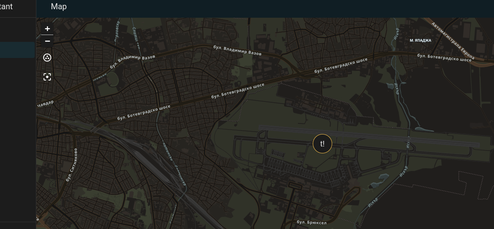
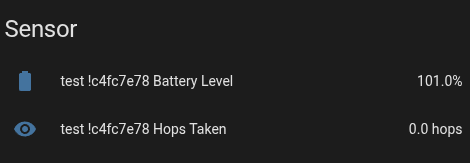
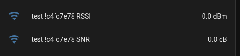

# 🛰️ Meshtastic Tracker for Home Assistant

## Overview

This custom [Home Assistant](https://www.home-assistant.io/) integration adds **native Meshtastic network support** — letting you track, monitor, and communicate with your Meshtastic nodes directly through Home Assistant.

The integration automatically creates **device trackers**, **telemetry sensors**, and **environmental data sensors** for all nodes visible within a given MQTT Meshtastic channel. It merges data across all gateways participating in that channel to maintain consistent node state visibility.

Additionally, the addon provides the ability to **send messages** to nodes via MQTT using the Meshtastic MQTT/JSON format.

> 🧩 Some parts of this integration are adapted from [kvj/hass_Mtastic_MQTT](https://github.com/kvj/hass_Mtastic_MQTT).  
> Updated, refactored, and expanded for modern Home Assistant and the latest Meshtastic protocol.

---

## ✨ Features

- 🗺️ **Device Tracker** — Tracks nodes across multiple gateways in the same MQTT channel  
- 🌡️ **Telemetry & Environment Sensors** — Battery, voltage, RSSI, SNR, hops, temperature, humidity, and more  
- 💬 **Send Messages** — Supports channel messages over Meshtastic MQTT/JSON (no private messages)  
- 🔧 **Local Meshtastic Library** — Uses a local version of Meshtastic Protobufs (v2.7.3) for Home Assistant compatibility  
- 🧩 **HACS Compatible** — Fully supported by the [Home Assistant Community Store](https://hacs.xyz/)

---

## ⚙️ Installation (Manual)

1. Copy this repository into your Home Assistant `custom_components` directory:  
   ```
   <config>/custom_components/meshtastic_tracker
   ```
2. Restart Home Assistant.  
3. Add the integration via:  
   **Settings → Devices & Services → Add Integration → Meshtastic Tracker**.  

---

## 🧩 Installing via HACS

You can install this integration directly through HACS.

### 🪄 Step 1 — Add the Repository to HACS

1. In Home Assistant, go to **HACS → Integrations**.  
2. Click the **⋮ menu** in the top-right → **Custom repositories**.  
3. Paste the repository URL:
   ```
   https://github.com/kodi1/meshtastic_tracker
   ```
4. Select **Integration** as the category.  
5. Click **Add**, then close the dialog.

### 🧰 Step 2 — Install the Integration

1. Go back to **HACS → Integrations**.  
2. Search for **Meshtastic Tracker**.  
3. Click **Download / Install**.  
4. Restart Home Assistant once complete.

### ⚙️ Step 3 — Configure in Home Assistant

1. Go to **Settings → Devices & Services → Add Integration**.  
2. Search for **Meshtastic Tracker**.  
3. Enter your MQTT broker details and the topic (e.g. `msh/EU_868/2/e/LongFast`).  
4. Save — entities will appear automatically.

---

## 📦 Dependency Notes

This integration uses a **local copy** of the Meshtastic protobufs and API from  
[Meshtastic Python v2.7.3](https://github.com/meshtastic/python/releases/tag/2.7.3).

### Why Local Protobufs?

Home Assistant’s internal Python environment often conflicts with the official Meshtastic package, primarily due to differences in `protobuf` and asyncio dependency versions.  
To prevent runtime import errors or version conflicts, this integration includes its own bundled protobuf definitions and uses them locally.

---

## 💬 Message Sending

Messages are sent and received using the **Meshtastic MQTT/JSON** format.  
Only **channel messages** are supported — direct (private) messages are not available since public node keys are not known.

For full details on message formats, see the official documentation:  
👉 [Meshtastic MQTT Integration Guide](https://meshtastic.org/docs/software/integrations/mqtt/)

Example topic for sending and receiving:
```
msh/EU_868/2/e/LongFast
```

---

## 🌉 MQTT Bridge Configuration

To connect your Home Assistant MQTT server to the Meshtastic MQTT broker, a **Mosquitto bridge** is required.

Example `mosquitto.conf` section:

```ini
# Meshtastic MQTT Bridge
connection meshtastic-bridge
address mqtt.meshtastic.org:1883
username meshdev
password large4cats

start_type automatic
cleansession true
try_private false
notifications false
bridge_attempt_unsubscribe true
remote_clientid <your_random_id>

# Bridge only the required topics
topic msh/EU_868/2/e/LongFast/# both 0 lora/ ""
```

### Notes:
- Replace `<your_random_id>` with a **unique random string**, e.g. `ha_bridge_01`.  
- The topic `msh/EU_868/2/e/LongFast` should match your configured Meshtastic channel.  
- Only the `json/mqtt` topic family is used by this integration for messaging.

---

## 🧠 How It Works

1. Subscribes to the configured Meshtastic MQTT topic.  
2. Parses MQTT/JSON packets locally using bundled protobufs.  
3. Creates `device_tracker` and `sensor` entities in Home Assistant.  
4. Provides the `send_packet` service for sending messages.

---

## 🧾 Example Entities

| Type | Entity ID | Description |
|------|------------|-------------|
| Device Tracker | `device_tracker.node_1234` | Node location |
| Sensor | `sensor.node_1234_battery` | Battery level |
| Sensor | `sensor.node_1234_rssi` | Signal strength |
| Sensor | `sensor.node_1234_snr` | Signal-to-noise ratio |
| Sensor | `sensor.node_1234_message` | Last received message |

---

## 🧰 Debugging

Enable debug logs in your Home Assistant `configuration.yaml`:

```yaml
logger:
  default: warning
  logs:
    custom_components.meshtastic_tracker: debug
```

---

## 🖼️ Screenshots

| Map | Telemetry | Environment |
|-----|------------|-------------|
|  |  |  |

---

## 🏷️ GitHub Topics

`home-assistant` • `homeassistant-custom-component` • `meshtastic` • `mqtt` • `iot` • `lora` • `lora-mesh` • `device-tracker` • `sensor` • `protobuf` • `mesh-network` • `hacs` • `hacs-integration` • `telemetry` • `environmental-sensors`

---

## 🛠️ Credits

- Based on [kvj/hass_Mtastic_MQTT](https://github.com/kvj/hass_Mtastic_MQTT)  
- Includes local protobufs from [Meshtastic Python 2.7.3](https://github.com/meshtastic/python/releases/tag/2.7.3)  
- Maintained and expanded for modern Home Assistant environments

---
